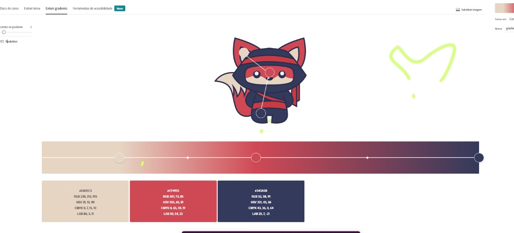
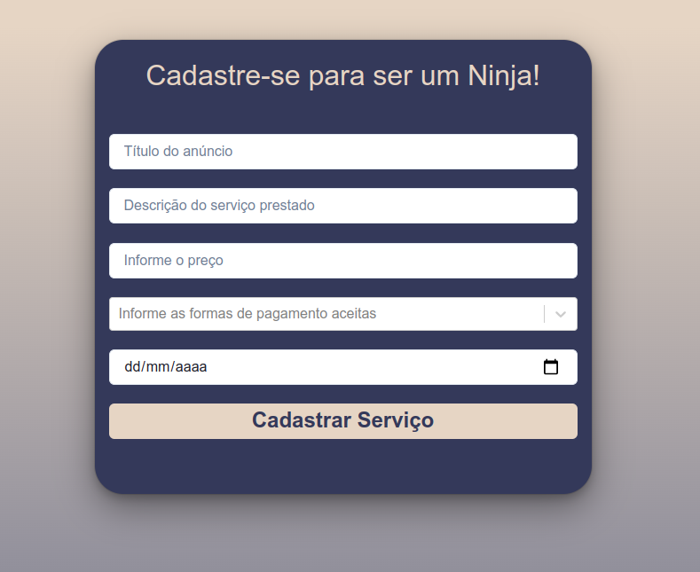
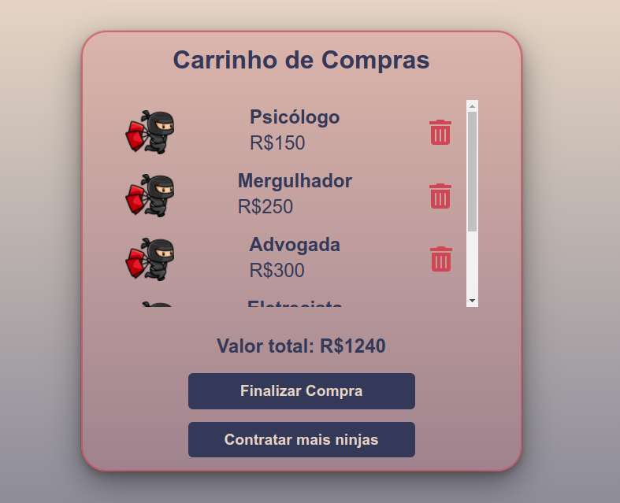
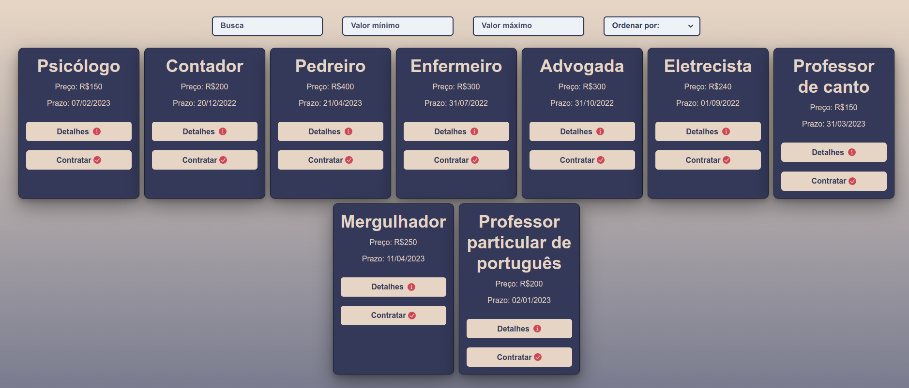
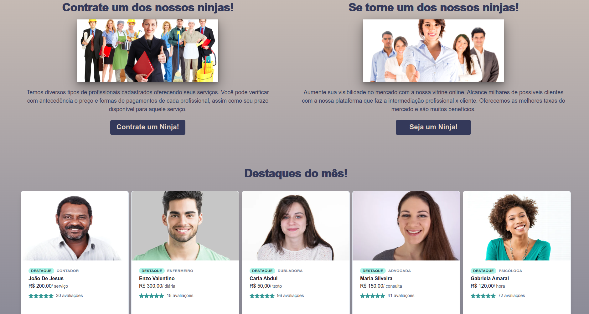
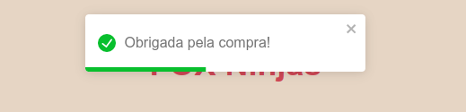
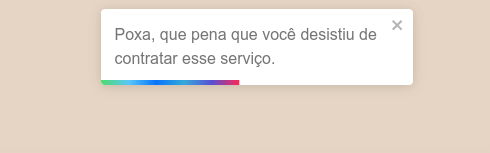
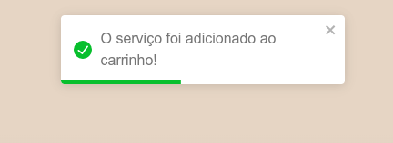

### Fox Ninjas

## Acesso ao site
Acesse aqui: https://foxninjas-alves.surge.sh/

## Sobre
O site Fox Ninjas, com uma interface limpa e intuitiva, realiza a intermediação entre a pessoa que deseja contratar um serviço e o prestador de serviço. De uma forma fácil e simplificada, o usuário, em poucos mínutos, encontra um profissional que pode resolver seu problema.

# O que você encontrará no site:

- Cadastrar serviço: o prestador de serviço pode cadastrar o serviço informando o nome, descrição, preço, formas de pagamento e prazo em que ficará disponível.
- Contratar serviço: o usuário pode navegar na página de serviços disponíveis, tendo a opção de clicar em um botão para ver mais detalhes, ocasião na qual será direcionado para outra página que conterá todas as informações sobre o serviço ou poderá clicar diretamente na opção contratar, o que faz com que o serviço seja adicionado ao carrinho.
- Carrinho de compras: no carrinho o usuário poderá verificar os produtos adicionados, tendo a opção de deletar cada um dos serviços do carrinho. Poderá também visualizar o valor total dos serviços adicionados. Encontrará também um botão que possibilitará retornar para a tela de contratação para que possa contratar mais serviços.
- Destaques do mês: os profissionais que se destacaram na prestação de serviços durante o mês corrente.
- Desenvolvedores: Foto de cada um dos desenvolvedores. Com um clique no nome, o usuário é redirecionado para o linkedin.
- Rodapé: no rodapé o usuário encontra informações sobre a empresa, como entrar em contato, perguntas frequentes, como trabalhar conosco e redes sociais.
- Filtros: existe a opção de o usuário ordenar os produtos por preço (crescente ou decrescente) ou também por título e prazo. O usuário pode procurar os produtos por valor mínimo e máximo e também por nome.
- Carregando: implementamos o desafio de colocar um gif enquando a página carrega.
- Toast: através da biblioteca toast do React colocamos alerts personalizados quando o usuário clica em contratar serviço, quando clica em deletar serviço do carrinho ou em finalizar compra.

# O que não funciona:

- Responsividade
- Implementamos o desafio de o usuário poder adicionar o produto apenas uma vez ao carrinho, mas em decorrência de alguns pequenos problemas quando entramos em fase de testes, decidimos não aplicar. No carrinho também temos um problema de quando adicionamos mais de uma vez o mesmo produto: quando clicamos para deletar apenas um, todos são deletados, mas o valor é excluido apenas de um produto.

## Tecnologias utilizadas:

- React
- Axios
- Chakra UI
- JavaScript
- Toast React

## Paleta de Cores: 

Decidimos a paleta de cores de acordo com o ninja escolhido para representar a marca: 

## Desenvolvido por:

- Andressa Urbano de Sousa Darzé
- David Henrique Souza da Silva
- Lucas Magalhães Pacheco
- Nicole Prim
- Raquel Baptista Burger

O projeto foi desenvolvido em equipe. Todos foram extremamente importantes para que fosse alcançado o resultado final. A comunicação foi sempre tranquila e as decisões tomadas todas em conjunto.

# Imagens:

